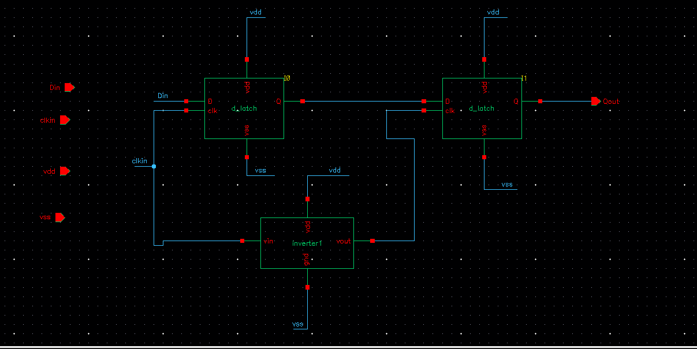
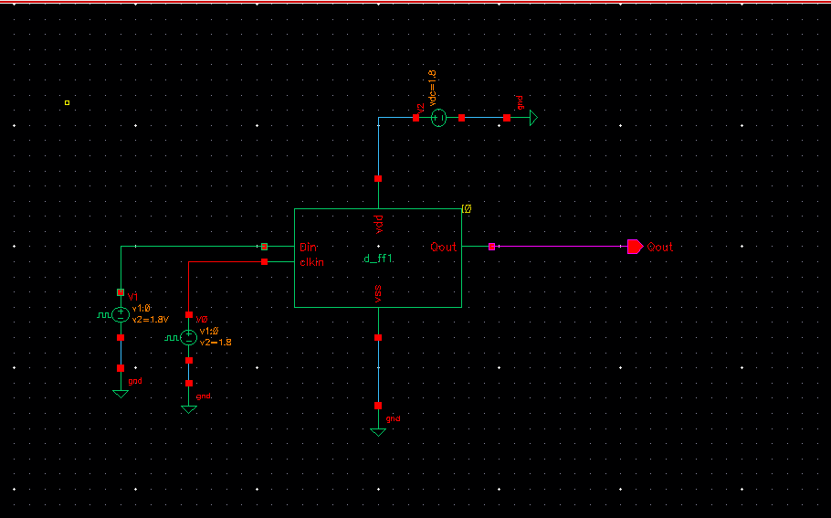
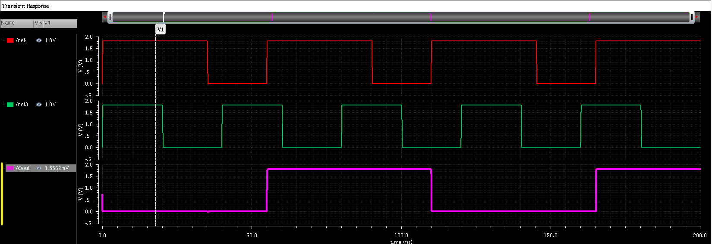

# Master-Slave D Flip-Flop Using Transmission Gates

## Overview

This project implements a **Master-Slave D Flip-Flop** using two **Transmission Gate (TG) based D Latches** in Cadence Virtuoso. The design demonstrates edge-triggered data storage by cascading two level-sensitive latches controlled by complementary clock signals.

The flip-flop captures the input data (`D`) at the active clock edge and holds the stored value until the next clock event.

---

## Objective

- Design a D Flip-Flop using Transmission Gate based D Latches.
- Verify edge-triggered operation through transient simulation.
- Analyze data capture and storage behavior.
- Understand the working of master-slave latch architecture.

---

## Theory

### D Latch

A D Latch is a level-sensitive storage element.

- When the latch is enabled, the output follows the input.
- When disabled, the latch retains the previously stored value.

### Master-Slave D Flip-Flop

A Master-Slave D Flip-Flop is formed by connecting two D latches in series:

1. **Master Latch**
   - Controlled by `CLK`
   - Samples the input data

2. **Slave Latch**
   - Controlled by `CLK̅`
   - Transfers the stored value to the output

Because only one latch is active at a time, the output changes only at the clock transition, resulting in edge-triggered operation.

---

## Circuit Architecture

```text
           D
           │
           ▼
    ┌─────────────┐
    │   Master    │
    │   D Latch   │
    └─────────────┘
           │
           ▼
    ┌─────────────┐
    │    Slave    │
    │   D Latch   │
    └─────────────┘
           │
           ▼
           Q

 Master Clock : CLK
 Slave Clock  : CLK̅
```

---

## Design Components

- Transmission Gates (PMOS + NMOS)
- CMOS Inverters
- Clock Source
- Data Input Source
- VDD = 1.8 V
- Ground (GND)

---

## Simulation Parameters

| Parameter | Value |
|------------|--------|
| Technology | CMOS 180 nm |
| Supply Voltage | 1.8 V |
| Analysis Type | Transient |
| Simulation Time | 200 ns |
| Clock Input | Pulse Source |
| Data Input | Pulse Source |

---

## Schematic



---

## Test Circuit



---

## Transient Waveform



---

## Waveform Description

| Signal | Description |
|----------|------------|
| CLK | Clock Input |
| D | Data Input |
| Q | Flip-Flop Output |

### Observations

- The output updates only at the active clock edge.
- The master latch samples the input data.
- The slave latch transfers the stored value to the output.
- The output remains stable between clock transitions.
- The circuit successfully stores one bit of information.

---

## Truth Table

| Clock Edge | D | Q(next) |
|------------|---|----------|
| ↑ | 0 | 0 |
| ↑ | 1 | 1 |
| No Edge | X | Q(previous) |

---

## Applications

- Shift Registers
- Counters
- Registers
- Finite State Machines (FSMs)
- Memory Elements
- Digital Processors
- Pipelined Architectures

---

## Folder Structure

```text
10_D_FlipFlop/
│
├── schematic.png
├── Test_Circuit.png
├── waveform.png
└── README.md
```

---

## Results

The Master-Slave D Flip-Flop was successfully designed and simulated using Cadence Virtuoso. The transient analysis confirms proper edge-triggered operation, where the output captures the input data only at the clock edge and retains its state until the next triggering event.

---

## Tools Used

- Cadence Virtuoso
- Spectre Simulator
- CMOS 90 nm Technology Library


