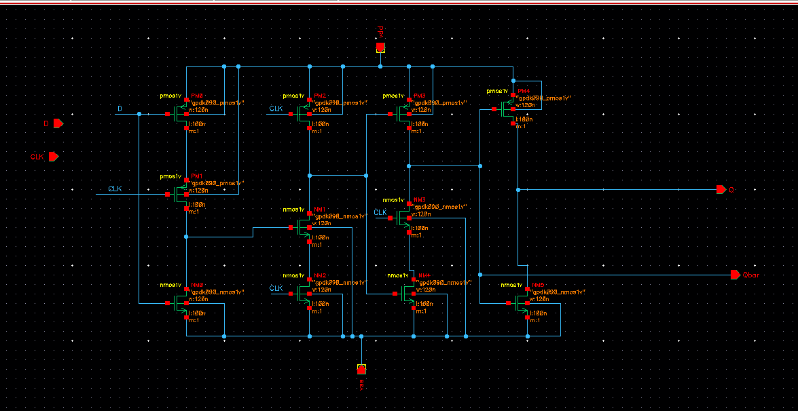
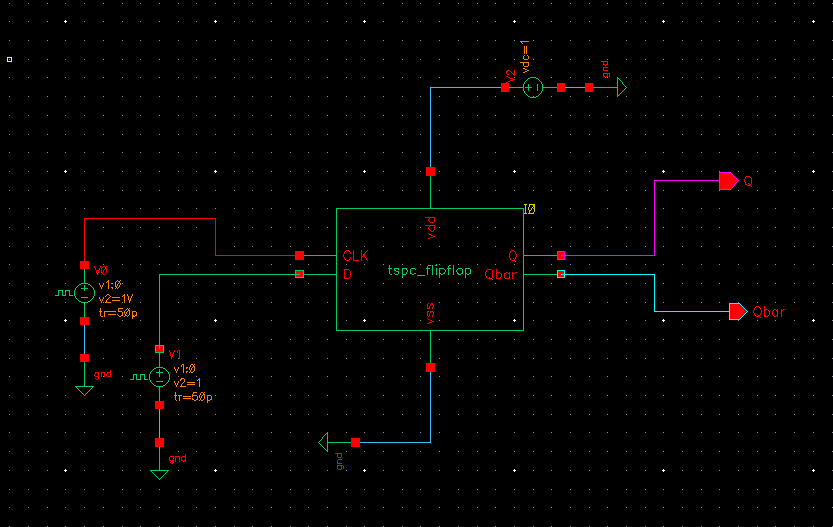
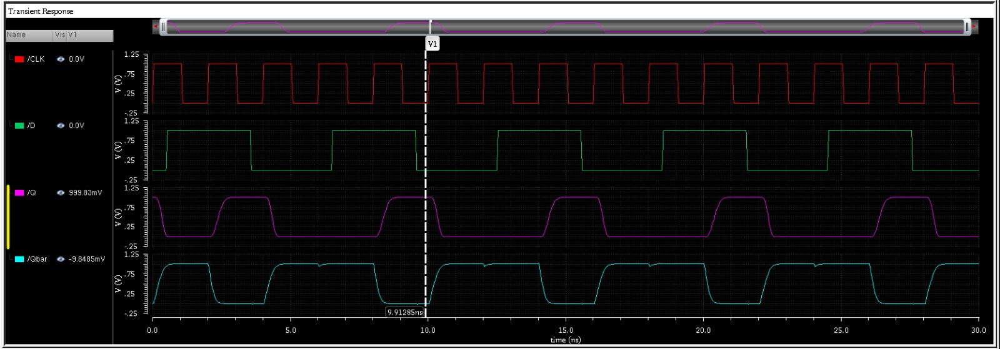

# True Single Phase Clock (TSPC) D Flip-Flop Design and Analysis using Cadence Virtuoso

## Overview

This project presents the design, simulation, and performance evaluation of a True Single Phase Clock (TSPC) D Flip-Flop implemented using GPDK 90nm CMOS technology in Cadence Virtuoso. TSPC logic is widely used in modern VLSI systems due to its high-speed operation, reduced clock loading, and low power consumption.

The designed TSPC D Flip-Flop was functionally verified using transient simulations, and important performance metrics such as Average Power Consumption, Rise Time, Clock-to-Q Delay, and Power Delay Product (PDP) were evaluated.

---

## Objectives

- Design a TSPC D Flip-Flop using CMOS transistors.
- Verify the functionality through transient simulation.
- Generate a reusable symbol for hierarchical design.
- Measure timing and power characteristics.
- Evaluate energy efficiency using Power Delay Product (PDP).
- Use the TSPC D Flip-Flop as a building block for larger sequential circuits.

---

## Theory

### What is a TSPC Flip-Flop?

True Single Phase Clock (TSPC) logic is a dynamic CMOS design technique that operates using only one clock phase.

Unlike conventional master-slave flip-flops that require both clock and complementary clock signals, TSPC circuits operate using a single clock signal, resulting in:

- Reduced clock distribution complexity
- Lower clock power consumption
- High-speed operation
- Reduced transistor count
- Improved energy efficiency

Because of these advantages, TSPC flip-flops are commonly used in:

- High-speed processors
- Frequency dividers
- Counters
- Clock generation circuits
- Low-power VLSI systems

---

## Design Specifications

| Parameter | Value |
|------------|---------|
| Technology | GPDK 90nm CMOS |
| Supply Voltage (VDD) | 1 V |
| Ground (VSS) | 0 V |
| Simulator | Spectre |
| Design Tool | Cadence Virtuoso |
| Analysis Type | Transient Analysis |

---

## Circuit Description

The TSPC D Flip-Flop consists of:

- PMOS pull-up network
- NMOS pull-down network
- Dynamic storage nodes
- Single-phase clock-controlled transistors
- Complementary outputs (Q and Qbar)

The circuit captures the input data at the active clock edge and stores the value until the next clock event.

---

## Schematic

### TSPC D Flip-Flop Schematic



The circuit was designed using CMOS transistors available in the GPDK90 technology library.

---

## Test Circuit

To verify the functionality of the TSPC D Flip-Flop, a transient testbench was created.

### Testbench Configuration

- VDD = 1 V
- Clock Input = Pulse Source
- Data Input = Pulse Source
- Ground Reference = VSS

### Test Circuit



---

## Functional Verification

Transient simulations were performed to verify the correct operation of the flip-flop.

### Observations

- Output Q follows input D at the active clock edge.
- Output Qbar remains complementary to Q.
- Data is correctly stored between clock transitions.
- Proper flip-flop functionality was observed.

### Output Waveforms



---

## Performance Analysis

The performance of the TSPC D Flip-Flop was evaluated using Cadence Virtuoso Calculator.

### 1. Average Current

Average supply current measured from transient simulation:

Iavg = 4.711 µA

---

### 2. Average Power Consumption

Average power is calculated using:

Pavg = VDD × Iavg

Substituting values:

Pavg = 1 × 4.711 µA

Average Power:

**Pavg = 4.711 µW**

---

### 3. Rise Time

Rise time was measured between 10% and 90% of the output voltage swing.

Measured value:

**Rise Time = 243.6 ps**

---

### 4. Clock-to-Q Delay

Clock-to-Q delay represents the time required for the output to respond after the triggering clock edge.

Measured value:

**Clock-to-Q Delay = 2.375 ns**

---

### 5. Power Delay Product (PDP)

Power Delay Product is calculated as:

PDP = Average Power × Propagation Delay

Substituting measured values:

PDP = 4.711 × 10⁻⁶ × 2.375 × 10⁻⁹

PDP = 1.119 × 10⁻¹⁴ J

Therefore:

**PDP = 11.19 fJ**

A lower PDP indicates better energy efficiency.

---

## Results Summary

| Parameter | Value |
|------------|---------|
| Supply Voltage | 1 V |
| Average Current | 4.711 µA |
| Average Power | 4.711 µW |
| Rise Time | 243.6 ps |
| Clock-to-Q Delay | 2.375 ns |
| Power Delay Product (PDP) | 11.19 fJ |

---

## Advantages of TSPC D Flip-Flop

- Single clock operation
- Reduced clock routing complexity
- Lower dynamic power consumption
- High-speed operation
- Suitable for deep submicron technologies
- Lower clock loading
- Improved energy efficiency

---

## Applications

- Binary Counters
- Gray Counters
- Frequency Dividers
- Shift Registers
- Clock Generation Circuits
- Digital Signal Processing Systems
- Microprocessors
- Low-Power VLSI Systems

---

## Future Work

- Layout implementation
- Area estimation
- Post-layout simulation
- Setup and Hold Time characterization
- Process-Voltage-Temperature (PVT) analysis
- Integration into Binary and Gray Counter architectures
- Comparison with conventional master-slave flip-flops

---

## Tools Used

- Cadence Virtuoso
- Spectre Simulator
- GPDK 90nm CMOS Technology

---

## Repository Structure

```
01_TSPC_DFF/
│
├── schematic.png
├── Test_Circuit.png
├── waveform.jpg
├── results.jpg
└── README.md
```

---
