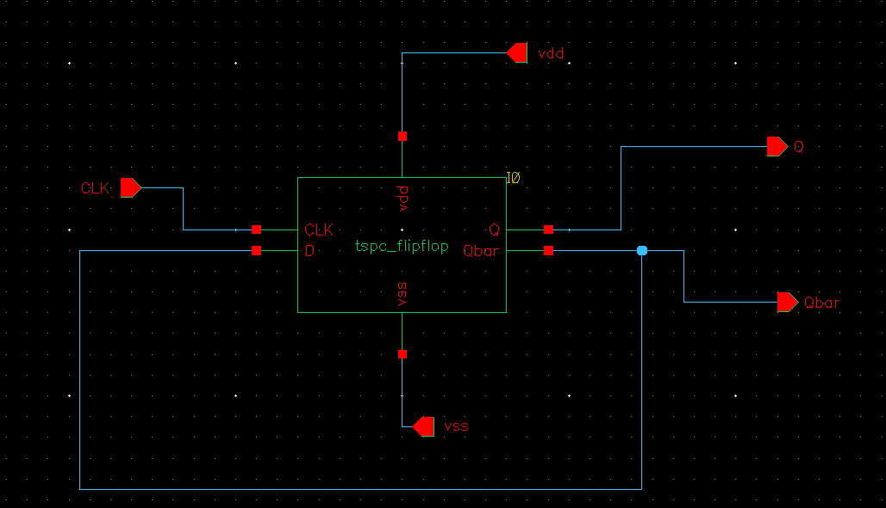
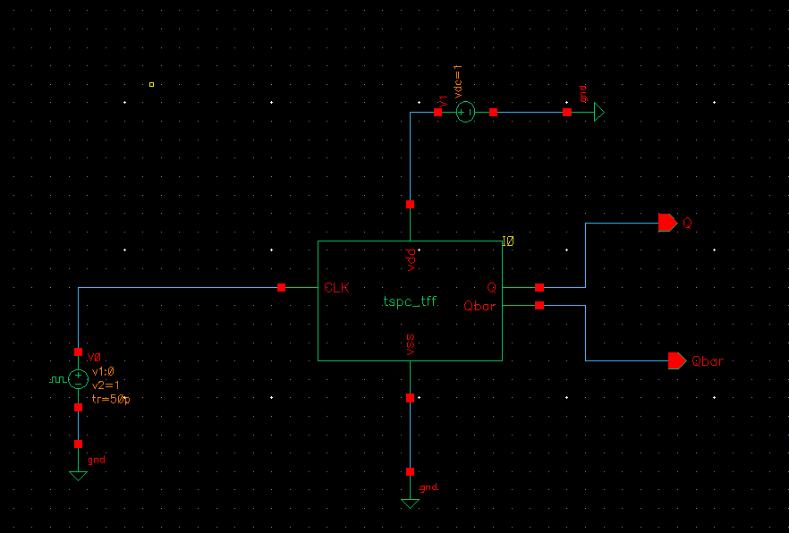
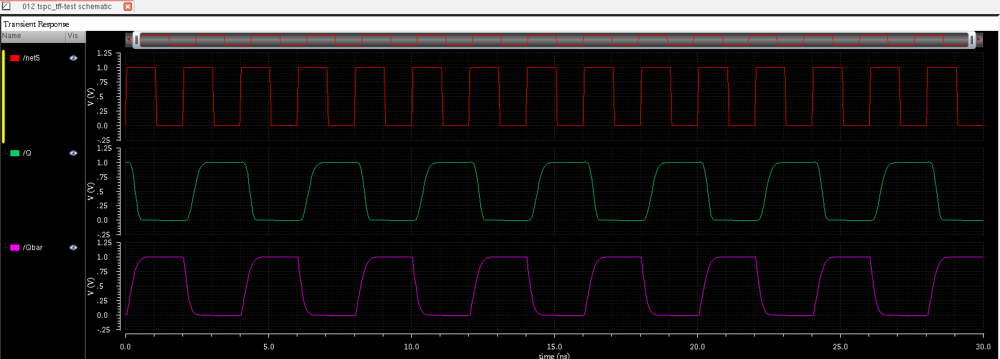

# True Single Phase Clock (TSPC) T Flip-Flop Design using Cadence Virtuoso

## Overview

This project presents the design and simulation of a True Single Phase Clock (TSPC) T Flip-Flop implemented using GPDK 90nm CMOS technology in Cadence Virtuoso.

The T Flip-Flop is derived from the TSPC D Flip-Flop architecture and operates using a single clock phase. The circuit toggles its output state on every active clock edge, making it suitable for frequency division and counter applications.

The design was verified through transient simulations and serves as the fundamental building block for the Binary Counter and Gray Counter developed in subsequent stages of the project.

---

## Objectives

- Design a TSPC-based T Flip-Flop.
- Verify toggle operation using transient analysis.
- Generate a reusable symbol for hierarchical circuit design.
- Use the T Flip-Flop as a building block for counter circuits.
- Demonstrate frequency division behavior.

---

## Theory

### What is a T Flip-Flop?

A Toggle Flip-Flop (T Flip-Flop) changes its output state whenever a triggering clock edge occurs.

Truth Table:

| T | Clock Edge | Q(next) |
|---|------------|----------|
| 0 | ↑ | Q |
| 1 | ↑ | Q̅ |

When T = 1:

- Output toggles at every clock pulse.
- Output frequency becomes half of the clock frequency.

Therefore:

```
fQ = fCLK / 2
```

---

## Why TSPC Logic?

True Single Phase Clock (TSPC) logic offers:

- Single clock operation
- Reduced clock power consumption
- High-speed performance
- Lower transistor count
- Simplified clock routing
- Improved energy efficiency

These advantages make TSPC circuits attractive for modern VLSI systems.

---

## Design Specifications

| Parameter | Value |
|------------|---------|
| Technology | GPDK 90nm |
| Supply Voltage | 1 V |
| Ground | 0 V |
| Simulator | Spectre |
| Design Tool | Cadence Virtuoso |
| Analysis | Transient |

---

## Circuit Implementation

The TSPC T Flip-Flop was constructed using CMOS transistors and dynamic logic principles.

The circuit captures the previous output state and toggles it at every active clock transition.

---

## Schematic

### TSPC T Flip-Flop Schematic



---

## Test Circuit

A dedicated testbench was created using:

- Pulse clock source
- VDD supply
- Ground reference

### Testbench



---

## Functional Verification

Transient simulations were performed to verify correct toggle operation.

### Observations

- Output changes state at every active clock edge.
- Frequency division behavior is observed.
- Output frequency is approximately half of the input clock frequency.
- Stable operation is achieved using a single clock phase.

---

## Simulation Waveforms

### Output Waveforms



---

## Results

The simulation confirms:

✓ Correct T Flip-Flop operation

✓ Toggle functionality

✓ Frequency division by 2

✓ Compatibility with TSPC architecture

✓ Suitability for counter implementation

---

## Applications

- Binary Counters
- Ripple Counters
- Frequency Dividers
- Clock Generation Circuits
- Prescalers
- Digital Timing Systems
- Sequential Logic Design

---

## Advantages

- High-Speed Operation
- Single Clock Requirement
- Reduced Clock Loading
- Lower Dynamic Power
- Suitable for Deep Submicron Technologies
- Easy Integration into Counter Architectures

---

## Future Work

- 7-Bit Binary Counter Design
- 7-Bit Gray Counter Design
- Area Analysis
- Power Analysis
- Layout Implementation
- Post-Layout Simulation
- PVT Analysis

---

## Tools Used

- Cadence Virtuoso
- Spectre Simulator
- GPDK 90nm CMOS Technology

---

## Repository Structure

```
02_TSPC_TFF/
│
├── schematic.png
├── Test_Circuit.png
├── waveform_tff.png
└── README.md
```


VLSI Design and Semiconductor Enthusiast

---
