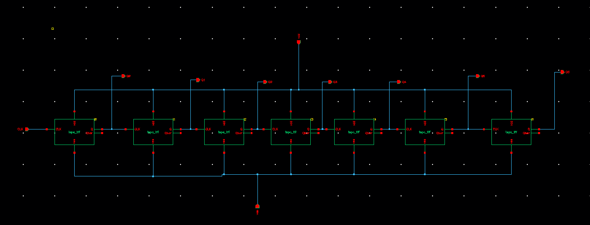
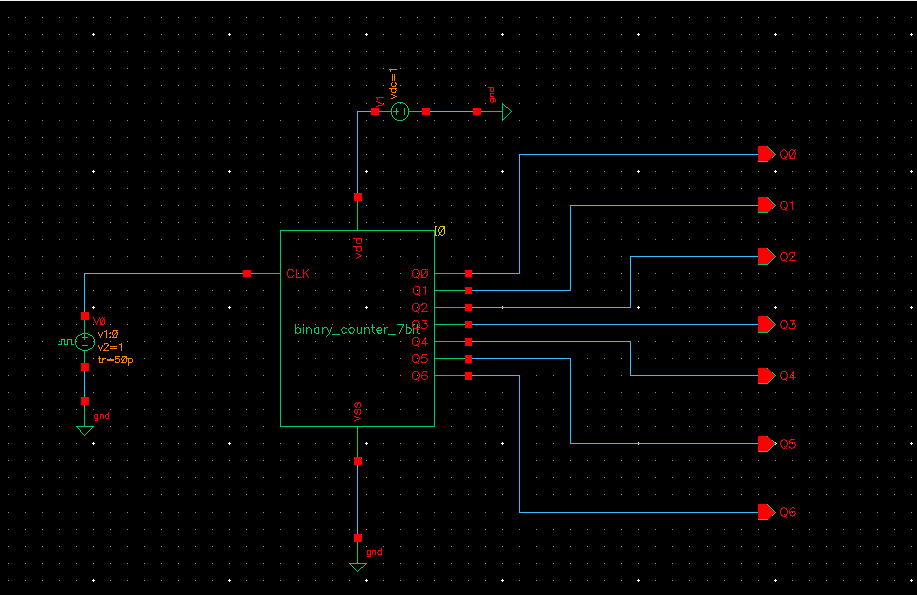
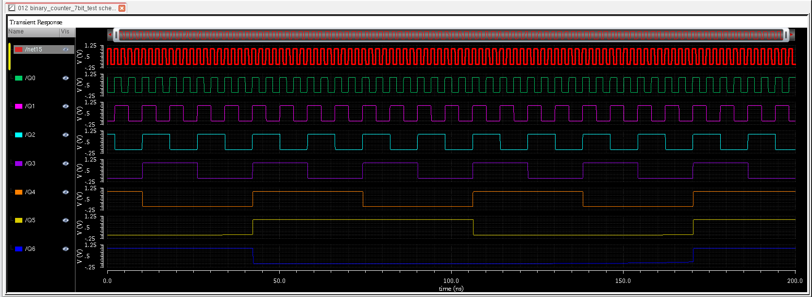

# 7-Bit Binary Counter Using TSPC T Flip-Flops

## Overview

This project presents the design and simulation of a 7-Bit Binary Counter implemented using True Single Phase Clock (TSPC) T Flip-Flops in Cadence Virtuoso using GPDK 90nm CMOS technology.

The counter is constructed by cascading seven TSPC T Flip-Flops. Each stage divides the frequency of the previous stage by two, resulting in a binary counting sequence from:

```
0000000 → 0000001 → 0000010 → ... → 1111111
```

The design demonstrates hierarchical VLSI design methodology where previously designed TSPC flip-flops are reused as building blocks for larger sequential circuits.

---

## Objectives

- Design a 7-bit binary counter using TSPC T Flip-Flops.
- Verify frequency division behavior.
- Observe binary counting sequence.
- Demonstrate hierarchical circuit design in Cadence Virtuoso.
- Analyze counter operation through transient simulation.

---

## Theory

### Binary Counter

A Binary Counter is a sequential circuit that progresses through a predetermined sequence of binary states upon the application of clock pulses.

For an N-bit counter:

```
Total States = 2^N
```

For a 7-bit counter:

```
Total States = 2^7 = 128
```

Count Range:

```
0000000 (0)
to
1111111 (127)
```

---

## Counter Architecture

The counter is built using seven cascaded TSPC T Flip-Flops.

Each T Flip-Flop operates in toggle mode.

Relationship:

```
Q0 = CLK ÷ 2
Q1 = CLK ÷ 4
Q2 = CLK ÷ 8
Q3 = CLK ÷ 16
Q4 = CLK ÷ 32
Q5 = CLK ÷ 64
Q6 = CLK ÷ 128
```

Each stage receives its clock from the output of the previous stage.

---

## Why TSPC Logic?

True Single Phase Clock (TSPC) logic offers:

- Single clock operation
- Reduced clock power consumption
- High-speed performance
- Lower transistor count
- Reduced clock loading
- Suitable for deep submicron technologies

These features make TSPC flip-flops attractive for counter and clocking applications.

---

## Design Specifications

| Parameter | Value |
|------------|---------|
| Technology | GPDK 90nm |
| Supply Voltage | 1 V |
| Ground | 0 V |
| Simulator | Spectre |
| Design Tool | Cadence Virtuoso |
| Analysis | Transient |
| Counter Size | 7-bit |

---

## Circuit Design Methodology

### Step 1

Design and verify the TSPC D Flip-Flop.

### Step 2

Construct a TSPC T Flip-Flop using the TSPC D Flip-Flop.

### Step 3

Create a reusable symbol for the TSPC T Flip-Flop.

### Step 4

Instantiate seven TSPC T Flip-Flops.

### Step 5

Cascade the stages to create the binary counter.

### Step 6

Generate output pins:

- Q0
- Q1
- Q2
- Q3
- Q4
- Q5
- Q6

### Step 7

Perform transient simulation and verify counting operation.

---

## Schematic

### 7-Bit Binary Counter Schematic



---

## Test Circuit

A dedicated testbench was created to verify the counter operation.

Components used:

- Pulse Clock Source
- VDD Supply
- Ground Reference
- Counter Under Test

### Test Circuit



---

## Simulation Waveforms

### Counter Output Waveforms



---

## Observations

### Frequency Division

Each stage divides the frequency of the previous stage by 2.

Example:

| Output | Frequency |
|----------|------------|
| Q0 | CLK/2 |
| Q1 | CLK/4 |
| Q2 | CLK/8 |
| Q3 | CLK/16 |
| Q4 | CLK/32 |
| Q5 | CLK/64 |
| Q6 | CLK/128 |

---

### Binary Counting Sequence

The outputs collectively generate binary numbers in ascending order:

```
0000000
0000001
0000010
0000011
0000100
...
1111111
```

---

## Results

Simulation confirms:

✓ Correct binary counting operation

✓ Proper toggle action of each TSPC T Flip-Flop

✓ Frequency division by powers of 2

✓ Stable sequential operation

✓ Successful hierarchical design implementation

---

## Applications

- Digital Counters
- Frequency Dividers
- Clock Management Circuits
- Digital Timers
- Event Counters
- Embedded Systems
- VLSI Sequential Logic Design

---

## Advantages

- High-Speed Operation
- Low Clock Loading
- Reduced Power Consumption
- Simple Cascaded Architecture
- Modular Design Approach
- Easy Scalability to Higher Bit Widths

---

## Future Work

- 7-Bit Gray Counter Design
- Area Analysis
- Power Analysis
- Layout Design
- Post-Layout Verification
- PVT Corner Analysis
- Performance Comparison with Conventional Counters

---

## Tools Used

- Cadence Virtuoso
- Spectre Simulator
- GPDK 90nm CMOS Technology

---

## Repository Structure

```
03_Binary_Counter_7bit/
│
├── schematic.png
├── Test_circuit.png
├── waveform.png
└── README.md
```
## Conclusion

A 7-Bit Binary Counter was successfully designed and simulated using TSPC T Flip-Flops in Cadence Virtuoso. The transient simulation results verify correct binary counting behavior and demonstrate the effectiveness of TSPC logic for high-speed sequential circuit design.
